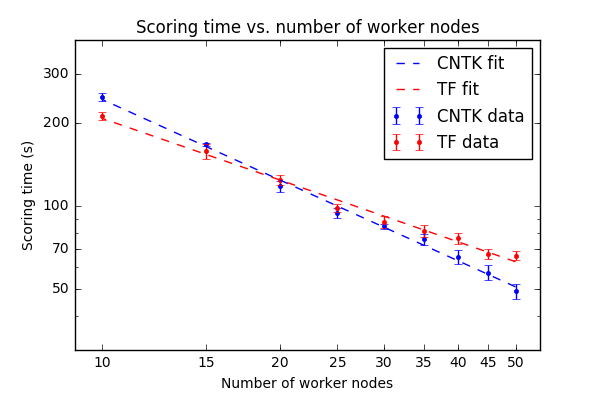
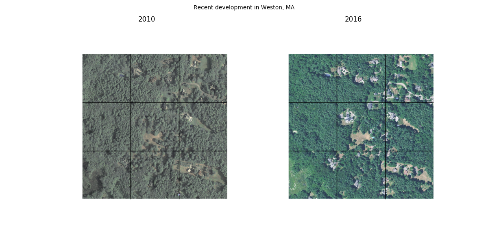
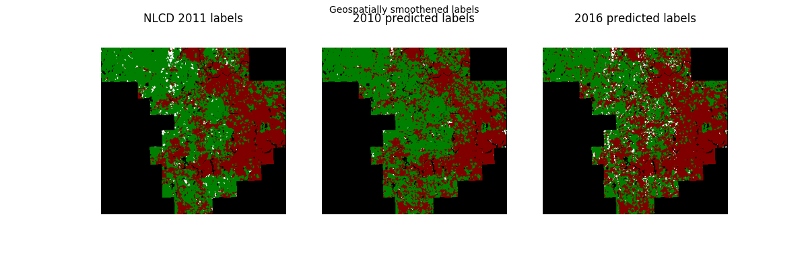

# Embarrassingly Parallel Image Classification: Inferring Land Use from Aerial Imagery

## Introduction

Deep neural networks (DNNs) are extraordinarily versatile artificial intelligence models that have achieved widespread use over the last five years. These neural networks excel at automated feature creation and processing of complex data types like images, audio, and free-form text. Common business use cases for DNNs include:

- Determining whether an uploaded video, audio, or text file contains inappropriate content
- Inferring a user's intent from their spoken or typed input
- Identifying objects or persons in a still image
- Translating speech or text between languages or modalities

Unfortunately, DNNs are also among the most time- and resource-intensive machine learning models. Whereas a trained linear regression model results can typically score input in negligible time, applying a DNN to a single file of interest may take tens or hundreds of milliseconds -- a processing rate insufficient for some business needs. Fortunately, DNNs can be applied in parallel and scalable fashion when evaluation is performed on Spark clusters.

This repository demonstrates how trained DNNs produced with two common deep learning frameworks, Microsoft's [Cognitive Toolkit (CNTK)](https://github.com/Microsoft/CNTK/wiki) and Google's [Tensorflow](https://github.com/tensorflow/tensorflow), can be operationalized on Spark to score a large image set. Files stored on [Azure Data Lake Store](https://azure.microsoft.com/en-us/services/data-lake-store/), Microsoft's HDFS-based cloud storage resource, are processed in parallel by workers on the Spark cluster. The guide follows a specific example use case: land use classification from aerial imagery.

## Fast start

To get started right away,
* Follow the instructions in the [Image Set Preparation](./image_set_preparation.ipynb) notebook to generate the training and validation datasets.
   * If you will use our provided image sets, you only need to complete the "Prepare an Azure Data Science Virtual Machine for image extraction" and "Dataset preparation for deep learning" sections.
   * If you seek a CNTK Spark operationalization example that doesn't require image set preparation or VM deployment, you may prefer [this walkthrough](https://github.com/Azure-Samples/hdinsight-pyspark-cntk-integration) instead.
* If you want to retrain an image classification DNN using transfer learning, complete the [Model Training](./model_training.ipynb) notebook.
   * You can skip this step if you choose to use our example DNNs.
* If you want to operationalize DNNs on Spark, complete the [Scoring on Spark](./scoring_on_spark.ipynb) notebook.
* If you want to learn how the retrained DNN can be used to study urban development trends, see the [Middlesex County Land Use Prediction](./land_use_prediction.md) page.
* For the motivation and summary of our work, see below.

## Land use classification from aerial imagery

In this guide, we develop a classifier that can predict how a parcel of land has been used -- e.g., whether it is developed, cultivated, forested, etc. -- from an aerial image. We apply the classifier to track recent land development in Middlesex County, MA: the home of Microsoft's New England Research and Development (NERD) Center. Aerial image classification has many important applications in industry and government, including:
- Enforcing tax codes (cf. [identification of home pools in Greece](http://www.nytimes.com/2010/05/02/world/europe/02evasion.html))
- Monitoring agricultural crop performance
- Quantifying the impact of climate change on natural resources
- Property value estimation and feature tracking for marketing purposes
- Geopolitical surveillance

This use case was chosen because sample images and ground-truth labels are available in abundance. We use aerial imagery provided by the U.S. [National Agriculture Imagery Program](https://www.fsa.usda.gov/programs-and-services/aerial-photography/imagery-programs/naip-imagery/), and land use labels from the [National Land Cover Database](https://www.mrlc.gov/). NLCD labels are published roughly every five years, while NAIP data are collected more frequently: we were able to use apply our land use classification DNN to images collected five years after the most recent training data available. For more information on dataset creation, please see the [Image Set Preparation](./image_set_preparation.ipynb) Jupyter notebook.

## Model training and validation

We applied transfer learning to retrain the final layers of existing Tensorflow ([ResNet](https://github.com/tensorflow/models/tree/master/slim)) and CNTK ([AlexNet](https://github.com/Microsoft/CNTK/tree/master/Examples/Image/Detection/FastRCNN)) models for classification of 1-meter resolution NAIP aerial images of 224 meter x 224 meter regions selected from across the United States. Retraining was performed on [Azure N-Series GPU VMs](http://gpu.azure.com/) with the [Deep Learning Toolkit](https://azuremarketplace.microsoft.com/en-us/marketplace/apps/microsoft-ads.dsvm-deep-learning) pre-installed. We created a balanced training and validation sets containing aerial images in six major land use categories (Developed, Cultivated, Forest, Shrub, Barren, and Herbaceous) from non-neighboring counties and collection years. For more information, please see the [Model Training](./model_training.ipynb) Jupyter notebook.

We used Spark to apply the trained CNTK and Tensorflow models to the 11,760 images in the validation set. Spreading the scoring task across multiple worker nodes allowed us to decrease the total time required to under one minute:

Our retrained models achieved an overall classification accuracy of ~80% on these six categories, with the majority of errors occurring between different types of undeveloped land (see the confusion matrix for the CNTK model's predictions, below):

For a subsequent application -- identifying and quantifying recently-developed land -- we further grouped these land use labels into "Developed," "Cultivated," and "Undeveloped" classes. Our model's overall accuracy at predicting these higher-level labels was roughly 95% in our validation set. For more information on model validation on Spark, see the [Scoring on Spark](./scoring_on_spark.ipynb) Jupyter notebook. 

## Inferring recent land development

The trained land use models were applied to 2016 aerial images tiling Middlesex County. The predicted 2016 labels were then compared to the ground-truth 2011 labels to identify putative regions of recent development: such an application may be useful for regulatory bodies seeking to automatically identify new structures or cultivated land in remote locations. An example result (with surrounding tiles for context) is included below:

Development could also visualized and quantified at the county level. In the figure below, regions classified as developed land are represented by red pixels, cultivated land by white pixels, and undeveloped land by green pixels.

The predicted land classes largely matched the true 2011 labels. Unfortunately, noisy year-to-year variation (likely reflecting differences in coloration and vegetation) were too large in magnitude to quantify general trends in development.

For more information on inferring recent land development with our trained DNNs, please see the [Middlesex County Land Use Prediction](./land_use_prediction.md) page.

## Contributing and Adapting

This project has adopted the [Microsoft Open Source Code of Conduct](https://opensource.microsoft.com/codeofconduct/). For more information see the [Code of Conduct FAQ](https://opensource.microsoft.com/codeofconduct/faq/) or contact [opencode@microsoft.com](mailto:opencode@microsoft.com) with any additional questions or comments.

The code in this repository is shared under the [MIT and Apache licenses](./LICENSE) included in this directory. Some Tensorflow scripts have been adapted from the [Tensorflow Models repository's slim](https://github.com/tensorflow/models/tree/master/slim) subdirectory (indicated where applicable). Cognitive Toolkit (CNTK) scripts for network definition and training have been adapted from the [CIFAR-10 Image Classification](https://github.com/Microsoft/CNTK/tree/master/Examples/Image/Classification/ResNet/Python) example.