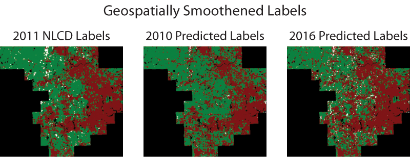
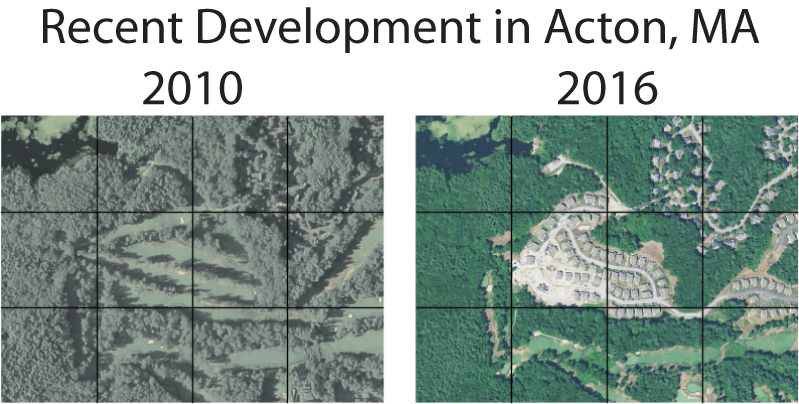
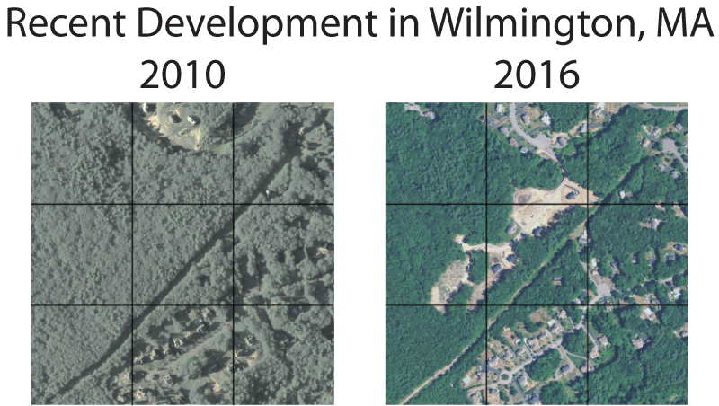
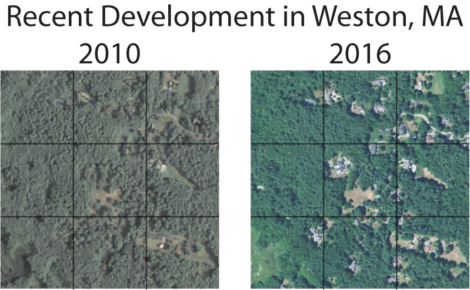

# Middlesex County Land Use Prediction

This notebook illustrates how trained Cognitive Toolkit (CNTK) and TensorFlow models can be applied to predict current land usage from recent aerial imagery. For more detail on image set creation, model training, and Spark cluster deployment, please see the rest of the [Embarrassingly Parallel Image Classification](https://github.com/Azure/Embarrassingly-Parallel-Image-Classification) repository.

## Image preparation and labeling

We have used National Land Cover Database (NLCD) data for our ground truth labels during model training and evaluation. The most recent NLCD dataset was published in 2011, but aerial images from the National Agriculture Imagery Program (NAIP) are available for 2016. Our trained models therefore allow us to bridge a five-year data gap by predicting land use in 2016.

To demonstrate this approach, we extracted a set of 65,563 images tiling Middlesex County, MA (home to Microsoft's New England Research and Development Center) at one-meter resolution from 2010 and 2016 NAIP data as [described previously](https://github.com/Azure/Embarrassingly-Parallel-Image-Classification/blob/master/image_set_preparation.ipynb). Note that unlike the image set used in training and evaluation, some of these images have ambiguous land use types: for example, they may depict the boundary between a forest and developed land. These images were then scored with [trained CNTK and Tensorflow land use classification models](https://github.com/Azure/Embarrassingly-Parallel-Image-Classification/blob/master/model_training.ipynb) applied in [parallel fashion using Spark](https://github.com/Azure/Embarrassingly-Parallel-Image-Classification/blob/master/scoring_on_spark.ipynb). Both models performed similarly; results for the CNTK model are shown.

For those unfamiliar with the region, we include below an aerial view of a 80 km x 70km region covering the county. The Greater Boston Area is centered along the ESE border of the county and extends through all but the northernmost regions.

## Visualizing land use

To visualize the results, we represent the labels of each 224 m x 224 m tile with a single color-coded pixel:
- Red represents developed regions (NLCD codes 21-24; see [legend](https://www.mrlc.gov/nlcd11_leg.php))
- White represents cultivated regions (NLCD codes 81-82)
- Green represents undeveloped and uncultivated regions (all other NLCD codes)

Below left, the plurality NLCD 2011 label is shown for each tile. (NLCD data is provided at 30-meter resolution, so any tile may contain multiple land use labels.) The predicted labels for each tile in 2010 (most directly comparable to the NLCD labels) and 2016 (most recent available) are shown at center and right, respectively.

We found a striking correspondence between true and predicted labels at both timepoints. the classification error for 2010 predictions (the most contemporary image set for the ground-truth 2011 labels) was ~4%. An uptick in the fraction of developed land was observed between 2010 and 2016 (see table below), but we believe this change is attributable in large part to the impact of image coloration and vegetation differences (e.g. browning in drought conditions) on labeling. Some systematic errors are noticable in the predictions, including the apparent mislabeling of some highways as cultivated land (white lines in 2016 image).

|   	|No. developed tiles   	|No. cultivated tiles (%)   	|No. undeveloped tiles  	|
|---	|---	|---	|---	|
|2010 predicted labels   	|27,584 (42.1%)   	|941 (1.4%)   	|37,038 (56.4%)   	|
|NLCD 2011 labels   	|28,537 (43.5%)   	|2,337 (3.6%)   	|34,689 (52.9%)   	|
|2016 predicted labels   	|28,911 (44.1%)   	|4,011 (6.1%)   	|32,641 (49.8%)   	|

For the purposes of mapping and quantifying land use, it may be preferable to discount isolated patches of differing land use. For example, an urban park may not be considered undeveloped land for the purposes of habit conservation, and construction of a rural homestead may not indicate substantial development in an otherwise cultivated region. We note that isolated tiles of land use can be removed by applying a 3x3 plurality-voting filter (with added weight for the center tile's own predicted label) to the raw predictions. The results of such a smoothing operation are shown below:

After smoothing, the classification error for predictions on 2010 images was reduced from 4% to 2.2%.

## Identifying newly developed regions

The ability to programmatically identify new development and cultivation in remote areas may be useful to government agencies that regulate housing and commerce, e.g. to identify tax evasion or enforce land use regulations.  Roughly 400 regions of putative new development were identified in Middlesex County based on a change in their label from "Undeveloped" in 2011 to "Developed" in our 2016 predictions. A few examples (including bordering tiles for context) are shown below:

In some cases, our land use classifier was sensitive enough to identify the development of single properties within a tile:

A visual comparison of the ~400 candidate tiles in 2010 vs. 2016 NAIP images reveals that roughly one-third have truly been developed; the false positives may reflect differences in lighting and drought conditions between the 2016 images and the training data.